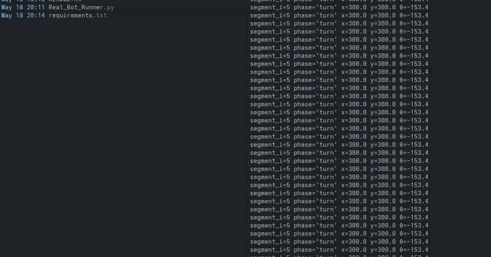

# MazeBot Project

 A Raspberry Pi–powered two-wheeled rover that solves table-top mazes using DFS for mapping and Dijkstra/BFS for shortest-path planning. Includes a Python/Pygame simulator for rapid prototyping and hardware integration via the Adafruit 16-Channel Servo HAT and Pi Camera for real-world demos. 



[Chassis Driver Demonstration](https://youtu.be/iw_Xe_JajT4?si=0qx1W1s7F3d5nseO)

# Materials

[3D-printed Base](https://www.thingiverse.com/thing:1562194)

[Raspberry Pi 3b](https://www.raspberrypi.com/products/raspberry-pi-3-model-b/)

[ArduCam IMX708](https://docs.arducam.com/Raspberry-Pi-Camera/Native-camera/12MP-IMX708/#raspberry-pi-native-camera)

# rpi prep:
- Install rpi minimal
- Enable ssh
- Enable I2C
- Connect 16-channel servo to board
- Connect servos to appropriate slots (check that they match scripts 0,1,2...)

# Installation:
> Project uses a virtual environment... Install dependenceis as follows:

``` shell
python3 -m venv venv #Inside this dir.
source ./venv/bin/activate

pip3 install -r requirements.txt
```

